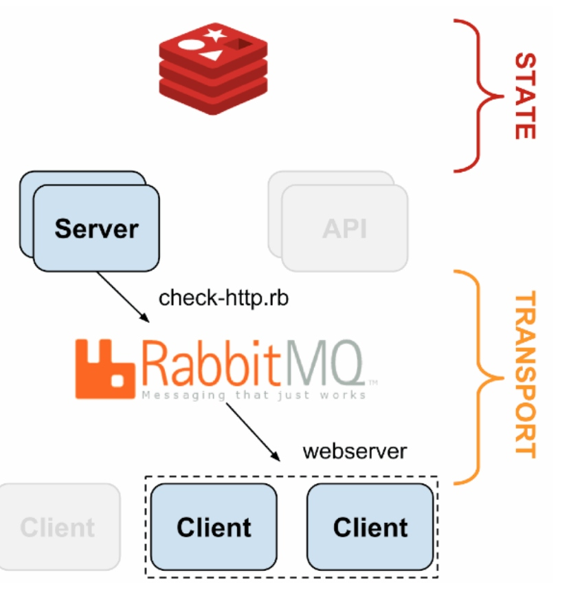
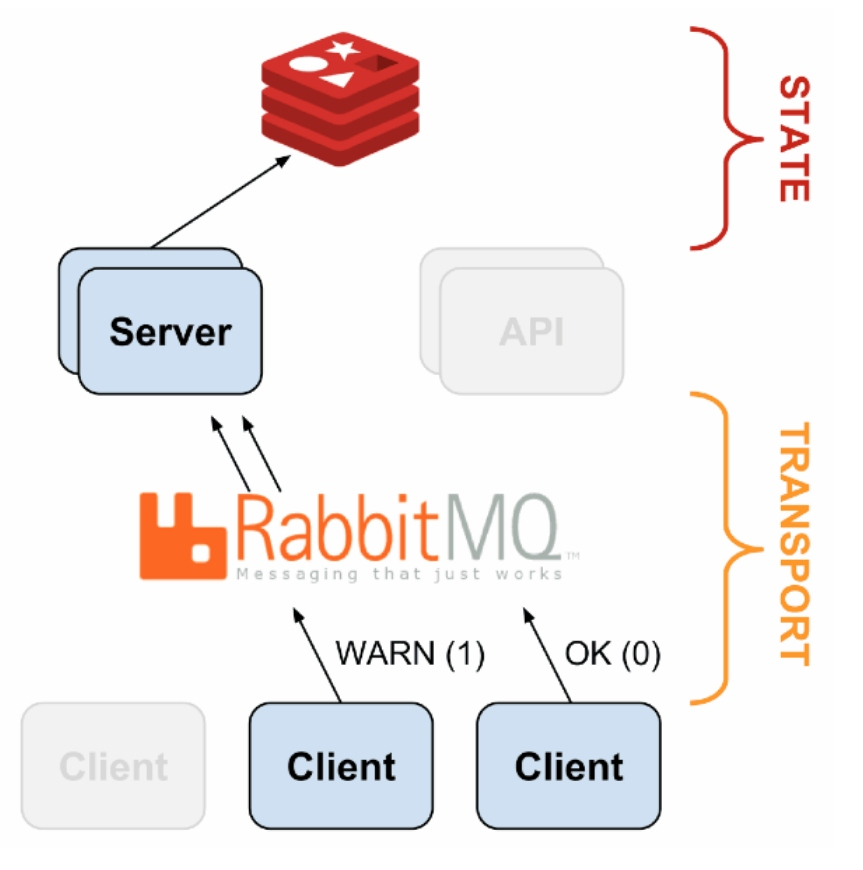
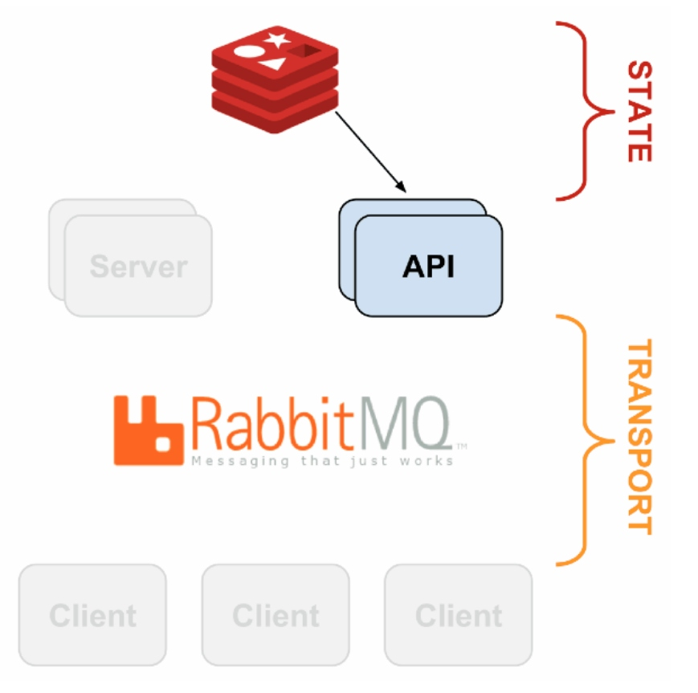
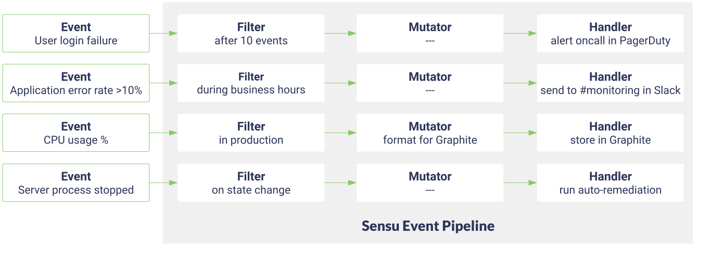

#### Conteúdo

1. [Sobre o Sensu](#sobre)

2. [Decisões de projeto e implementação](#impl)
   1. [Versão e repositórios dos containers](#versao)
   2. [Buildar imagens ao invés de usar prontos](#build)
   3. [Arquivos gitignore](#gitignore)
   4. [Volume mapeado](#conf)
   5. [Envio de dados coletados para o Banco de Dados - InfluxDB](#envioinfluxdb)
   6. [Alertas](#alertas)

---

### 1. Sensu 

A documentação da ferramenta completa, explicando funcionamento e tudo pode
ser encontrada no site oficial Sensu >> Documentação >> opção de documentação
[Sensu Core versão 1.4.3](https://docs.sensu.io/sensu-core/1.4/).

---

### 2. Decisões de projeto e implementação 

#### A. Versão e repositórios dos containers 

##### __Versão:__ Estamos usando o Sensu Core versão 1.4.3.

  - A escolha do Sensu Core foi devido ao Sensu Go não estar disponível na época
do projeto de implementação do Sensu.

  - O uso da versão 1.4.3 foi porque era a última disponível no repositório
sstarcher do container. A 1.6.1 tinha TAG latest, tag de uso desaconselhado para
 ambiente de produção.

##### __Containers:__ 

###### Arquitetura Sensu

Podemos ver a dinâmica dos processos que contém o sensu nas imagens:

O sensu é composto por containers: 

- Sensu Servidor, que é o sensu propriamente dito, faz todo o processamento e 
ações.

- Sensu Client: processo que coleta os dados do host. Fica no host monitorado, e
 se comunica e envia os dados coletados do host para o servidor aqui.

- Sensu Transporte (RabbitMQ): O Sensu precisa de um transporte para fazer a 
comunicação entre o cliente e o servidor, a troca de dados entre eles e envio 
dos dados coletados pelo cliente. Isto é feito pelo RabbitMQ. Os containers 
Sensu são informados para usarem o container RabbitMQ como seu transporte 
através de environment variables passadas e de arquivos de configuração mapeados 
 no Sensu Server.

>>>
O container RabbitMQ usado é o oficial.
>>>

- Sensu Banco de Dados (Redis): O Sensu precisa de um banco de dados para 
armazenar suas informações internas de funcionamento. Essa tarefa é cumprida 
pelo Redis. Os containers Sensu são informados para usarem o container Redis 
como Banco de Dados através de environment variables passadas e de arquivos de 
configuração mapeados no Sensu Server.

>>>
O container Redis é o oficial.
>>>

- API Sensu: A API é usada para consultas de estado sobre o Sensu, é como um 
canal para realizar consultas sobre o Banco da Dados Redis para obter todas as 
informações do Sensu. A porta usada para a API é a usada oficialmente neste 
caso.

Para Sensu Server e API (E para o cliente de testes na pasta `monitored-hosts`) 
é usado o container Sensu do [REPOSITÓRIO SSTARCHER](https://github.com/sstarcher/docker-sensu).
A escolha deste container foi devido à simplificação feita pelo autor que 
aumenta a clareza, por permitir várias opções de configuração apenas com o 
preenchimento de environment variables também.

###### Possível Migração para Sensu Go

>>>
__Migração para Sensu Go__:
A migração para Sensu Go é extremamente recomendada e está também indicada nas
issues do projeto aqui. 

Em dois ambientes diferentes que a monitoração foi implementada, de tempo em 
tempo o Sensu client executa algum processo interno que, como vimos em 
experimentos, causa o aumento do load nas máquinas (um aumento de load nem
sempre acompanhado por CPU? Estranho.). Há evidências de que seja devido à
linguagem ruby, questões internas dela.

A nova versão do Sensu foi lançada, Sensu Go, com novo nome porque não tem como
reaproveitar praticamente nada da antiga, é outra ferramenta, outro projeto com
a mesma finalidade. Assim, ao migrar, perde-se os checks, filtros, alertas e
conexão com influxdb implementada, além de precisar trocar todos os containers 
e construir novos no lugar. Mesmo assim é altamente recomendado por o Sensu 
poder estar causando sobrecarga nos host monitorados e sendo invasivo. 
>>>

---

#### B. Imagem build e não a pronta 

##### Para o servidor

A decisão de buildar a imagem do servidor foi para tornar embutido na imagem
a instalação de uma extensão e de um plugin sempre usados (um para enviar os
dados coletados ao banco de dados e a outra para o permitir o envio de e-mails
de alerta, respectivamente). Se não estivesse em imagem buildada aí toda vez
seria necessário fazer isto em tempo de execução, desnecessário.

A imagem se encontra em `sensu/Dockerfile`.
 
##### Para o cliente de testes

O cliente de testes foi buildado para conter os plugins necessários para seus
checks locais, instalações para os checks locais e o rsyslog necessário para
envio de logs.

A imagem se encontra na pasta `monitored-hosts`.

---

#### C. Arquivos .gitignore 

Toda vez, ao iniciar o serviço, arquivos de configuração são criados na pasta
_conf.d_, baseados nas environment variables passadas e configurações mapeadas
nos volumes. São criados arquivos de configuração com extensão _.json_ que são
uma síntese das configurações, e então são usados pelo sensu.

Foi colocado gitignore de modo a não carregar estes arquivos de geração
automática pelo sensu, arquivos que não são para edição sem ser pelo sensu
 (são sobrescritos quando editados).

---

#### D. Volume mapeado 

Foi mapeado o volume do container `/etc/sensu/conf.d`. Esta pasta é onde o 
sensu armazena todos os seus arquivos de configuração.

A decisão de mapea-lo foi para colocar novas configurações dinamicamente,
como novas extensões, handlers, etc.

O sensu se comporta de acordo com os arquivos nesta pasta.

>>>
Lembrando que os arquivos de configiração gerados automaticamente pelo sensu
não estão aqui por não serem para edição sem ser pelo sensu, eles são sempre
criados mas estão no gitignore para não aparecerem aqui.
>>>

---

#### E. Envio de dados coletados para o Banco de Dados (InfluxDB) 

[EXTENSÃO](https://github.com/sensu-plugins/sensu-extensions-influxdb2)

##### Arquitetura

O envio de dados para o InfluxDB é feito usando a extensão influxdb, 
localizada no arquivo `conf.d/extensions/influxdb.json`. Além deste arquivo, 
o arquivo `conf.d/influx.json` fornece contexto para o envio, fornecendo 
informações da instância do InfluxDB em questão e outros detalhes. 

A extensão funciona da seguinte forma: nos checks do sensu no cliente é colocado 
o handler _metrics_, que chama a extensão influxdb para parsear este dado e 
enviá-lo ao influxdb.

##### Arquivos
    
###### __conf.d/extensions/influxdb.json__

O arquivo mostra a extensão a ser usada. O history é indispensável para dinâmica
do funcionamento (Mais detalhes no link da extensão aqui acima).

###### __conf.d/influxdb.json__:

Este arquivo fornece contexto para o envio dos dados ao InfluxDB: qual database 
usar nele, endereço do host onde ele está (como são containers o host está como 
influxdb), portas e senhas, e por fim template: o template é quem determina como 
interpretar os dados do sensu e construir "tabelas" a partir deles.

>>>
Tabelas entre aspas porque não é um banco de dados relacional mas as 
estruturas de armazenamento tem comportamento praticamente igual ao de 
 tabelas SQL.
>>>

A extensão usada pega cada dado fornecido pelo Sensu e o coloca no formato 
[Line Protocol](https://docs.influxdata.com/influxdb/v1.7/write_protocols/line_protocol_reference/), formato usado para inserir os dados no InfluxDB. O template 
instrui como fazer essa conversão. Por exemplo: O template 
`{".*\\..*": "host.measurement*"}` diz: trate os primeiros dados antes do ponto 
como nome do host. Trate o dados após o ponto como nome do measurement 
(measurement = tabela SQL InfluxDB). Com as instruções de como deve ser lido cada
trecho, depois são colocadas em ordem pela extensão e enviadas ao InfluxDB.

O campo templates pode ter vários templates, de modo a abranger dados diferentes 
chegando. Primeiro a extensão tenta encaixar os dados no primeiro template, 
se não se adequam é tentado o segundo template, e assim por diante.

Um template consiste de uma expressão regular (REGEX) do lado esquerdo do : , que
vai ser aplicada aos dados sensu coletados. Para saber o formato de saída 
original dos dados coletados é só executar um script de coleta e observar a 
saída gerada. Os scripts de coleta estão indicados dentro dos checks, no campo 
command. Executar na própria máquina o comando em "command" mostra a saída sobre 
a qual o REGEX é aplicado. 

Uma vez aplicado o REGEX, sempre que der match de REGEX, o campo será atribuído 
como valor do que está escrito do lado direito do : do template, que são os 
campos do Line Protocol.

Para construir templates os links ajudam:
   - [EXTENSÃO](https://github.com/sensu-plugins/sensu-extensions-influxdb2)
   - [CONCEITOS INFLUXDB](https://docs.influxdata.com/influxdb/v1.7/concepts/key_concepts/)
   - [LINE PROTOCOL](https://docs.influxdata.com/influxdb/v1.7/write_protocols/line_protocol_reference/)
   - Executar os checks sensu para ver as saídas, na própria máquina.

###### __handlers: metrics__

Entre os handlers vemos o handler metrics, que é o handler que chama a extensão 
influxdb para cada dado coletado. Ele contém os handlers influxdb e o handler 
none, ambos essenciais para o funcionamento da extensão.

Observações: O handler está como conjunto e precisa estar junto ao handler none 
pela própria especificação e projeto da extensão, por arquitetura interna dela. 
Isso pode ser visto na [doc da extensão](https://github.com/sensu-plugins/sensu-extensions-influxdb2).

---

#### F. Alertas 

Os alertas são implementados através dos handlers e filters sensu. 

Uma vez um cliente sensu conectado, ele manda de 20 em 20 segundos (tempo que 
pode também ser personalizado) um _keepalive_ informando contato para o sensu 
servidor. Quando o sensu servidor passa muito tempo sem receber o 
_keepalive_ de um dado cliente, ele mesmo cria um evento de warning e de 
critical, um para cada quantidade de tempo. Estes tempos foram definidos nas 
environment variables do cliente sensu, CLIENT_KEEPALIVE_CRITICAL e 
CLIENT_KEEPALIVE_WARNING, e são aplicadas na configuração do sensu no container. 
Então, também no cliente, foi definido a environment variable 
CLIENT_KEEPALIVE_HANDLER, que informa qual handler usar ao receber eventos 
_keepalive_. (Para ver como essas environment variables viram arquivos de 
configuração acesse o [CONTAINER SSTARCHER](https://github.com/sstarcher/docker-sensu), veja em templates >> client.json).

>>>
Obs.: Veja todas as environment variables do client no _docker-compose.yaml_ de
 um client de teste, na pasta `monitored-hosts`.
>>>

Assim, o server lida com eventos keepalive usando o handler mailer, definido 
entre os handlers dele.

Relembrando:

Eventos keepalive são gerados sempre em duas condições: 

- down, quando se percebe que houve perda de contato com um dado cliente. O 
cliente está há mais de CRITICAL segundos sem notificar o servidor que está vivo.

- up, quando um cliente que está no sistema com estado CRITICAL (desaparecido) é 
reencontrado.

Quando chega o evento de keepalive é chamado o handler mailer, definido em 
`conf.d/handlers/handlers.json`. O handler mailer é um conjunto de handlers up 
e down, em que ambos chamam o envio de e-mail para notificar a situação (comando 
no command de cada um deles). Para dar contexto ao handler mailer (especificar 
detalhes como servidor SMTP usado para envio, login, etc) há o arquivo 
`conf.d/handlers/mailer.json`. 

>> Obs.: Está sendo usado o servidor STMP do DCC (CRC), o mesmo usado para os 
e-mails DCC. Para isso só foi preciso informar seus dados (disponíveis no site 
do CRC-DCC) e um login e senha de uso dele, smtp_username e smtp_password. Estes
 valores não aparecem no arquivo mailer.json seus valores porque estão como 
environment variables e são substituídos na hora por script feito no GitLab do 
projeto, área do projeto de scripts e senhas nas configurações do GitLab. Isso 
para não disponibilizar dados sensíveis. 

Como estava sendo dito, o handler mailer receve um evento de keepalive e usa 
dois handlers para o tratar, mailer-up e mailer-down. Ambos são chamados para 
o evento. 

O handler mailer-down usa seu filtro keepalive-down para testar o 
evento: se o evento satisfizer as condições do filtro keepalive-down ele é 
um evento de notificação de desaparecimento, e se satisfizer essas condições aí 
sim o handler é aplicado: envia-se uma notificação por e-mail de down. 

O mesmo se aplica ao handler up: é aplicado no evento o filtro keepalive-up, 
para detectar se é um evento de up. Se o evento satisfizer as condições ele é 
um evento de up, então sim o handler up é usado e uma notificação de volta do 
desaparecimento é enviada.

Os filtros keepalive-up e keepalive-down estão definidos em `conf.d/filters/`.
