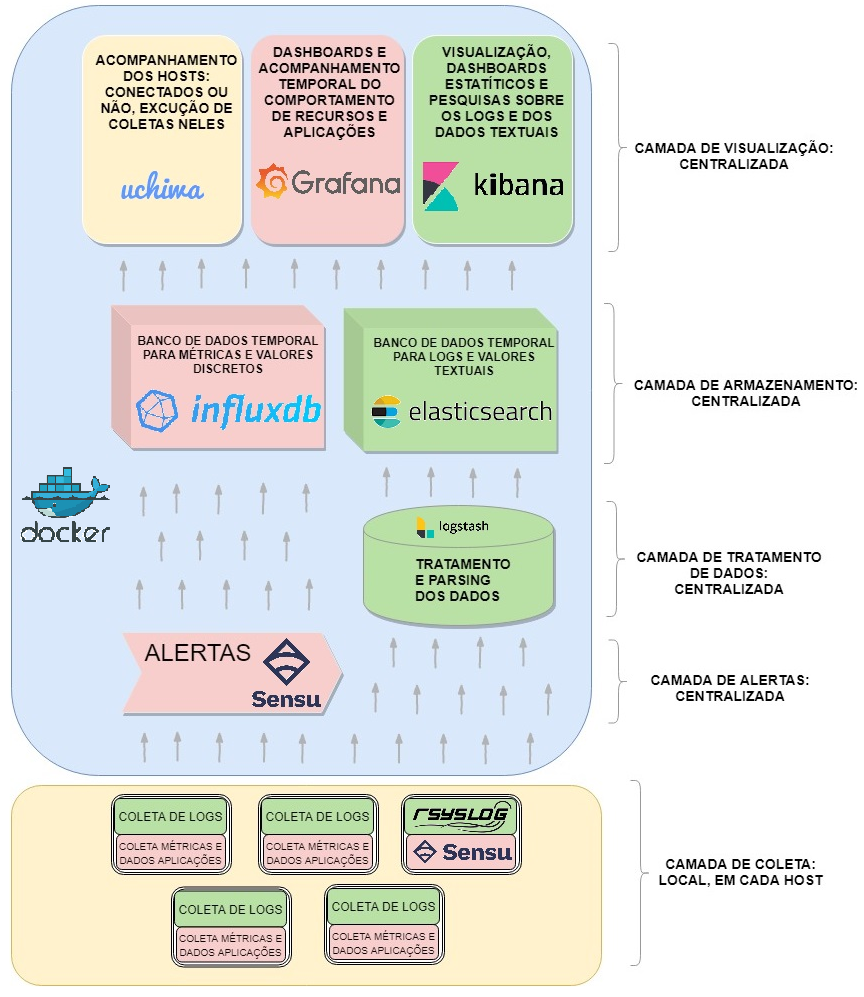

                                                                                

O sistema está implementado usando containers _Docker_. Cada componente está 
isolado em um container, e os containers se comunicam pelas redes Docker. Todos 
os componentes, redes e volumes da monitoração estão na mesma pilha de serviços 
docker, definida no arquivo _docker-compose.yaml_ principal.

#### Sumário

1. [Componentes](#componentes)

   1. [Servidor de Monitoração](#servidor)

   2. [Hosts monitorados](#hosts)

2. [Configuração do Ambiente de execução](#ambiente)
    
   1. [Recomendações para ambiente de desenvolvimento e testes](#dev)

   2. [Recomendações para ambiente de Produção](#prod)

---

### 1. Componentes 

#### A. Servidor de Monitoração 

Os serviços / componentes do sistema são:

1. Tratamento de métricas coletadas nos hosts: 
[Sensu](./doc-components/sensu.md)

   * Sensu server: Servidor Sensu, onde é feito todo o processamento dos 
     dados recebido. É o componente sensu mesmo.

   * Sensu API: Processo que faz a comunicação e requisições Sensu.

   * Redis: Banco de Dados para armazenar os dados Sensu.

   * RabbitMQ: Ferramenta usada como transporte para comunicação entre Sensu
     Server e hosts. 

2. Banco de Dados para armazenar as métricas coletadas:
[InfluxDB](./doc-components/influxdb.md)

3. Dashboards para análise e visualização dos dados: 
[Grafana](./doc-components/grafana.md)

4. Processador de dados dos logs antes da entrada no Banco de Dados: 
[Logstash](./doc-components/elk.md)

5. Banco de Dados de Logs: 
[ElasticSearch](./doc-components/elk.md)

6. Dashboards e visualização gráfica dos logs: 
[Kibana](./doc-components/elk.md)

7. Visualização dos hosts conectados, acompanhamento de coletas de métricas e 
  dos serviços do Sensu: 
[Uchiwa](./doc-components/uchiwa.md)

PLUS:

- Documentação sobre integração do componentes via containerização: 
[Docker](./doc-ambience/docker.md)

#### B. Hosts monitorados 

Os hosts monitorados precisam ter:

- Gerenciador de logs [rsyslog](./doc-components/rsyslog.md) instalado e 
executando

  - Usando os arquivos de configuração da pasta `monitored-hosts/rsyslog`

- Agente [Sensu](./doc-components/sensu.md) (_sensu-client_) instalado e 
executando (para coleta das métricas no host), com:

  - __Para fazer coleta igual:__
   
    - __Mesmos Scripts__:  Possuindo instalados na máquina monitorada os 
    plugins sensu de coleta indicados no arquivo `monitored-hosts/Dockerfile`, 
    seção local checks deste arquivo.

    - __Mesmas instruções de coleta__: Possuindo na pasta
    `./etc/sensu/conf.d/checks/` da máquina monitorada os arquivos da pasta
    `monitored-hosts/sensu/` do repositório aqui.

>>>
  - `OU`__para fazer aumentar a monitoração ou monitorar outros componentes::__

      - Escolher novos componentes e aplicações para se monitorar: 
      escolher plugins que monitoram estes na 
      [lista de monitoração disponível](https://github.com/sensu-plugins),
      ou fazer seu script de coleta compatível com Sensu (ver na doc Sensu
      os requisitos de novo script de coleta).
 
      - [Instalar os plugins escolhidos na máquina monitorada](https://docs.sensu.io/sensu-core/1.4/installation/installing-plugins/)
      
      - Colocar novas instruções para o sensu de coleta usando estes novos
      plugins: copiar um arquivo da pasta `./etc/sensu/conf.d/checks/`, 
      renomeá-lo para nome do novo componente monitorado, e trocar seu 
      comando pelo comando fornecido pelo plugin novo. Normalmente cada plugin 
      fornece diversos scripts de coleta (comandos). Executá-los onde foram
      instalados (executar o arquivo mesmo) e escolher qual será usado.

      - Ver se os templates influxdb atendem a nova coleta (raramente precisa,
      atendem praticamente sempre). Para ver, acessar seção _conexão influxdb_ 
      da documentação do Sensu implementado aqui.

      - No Grafana, copiar um Dashboard feito e apenas trocar a consulta SQL
      do novo dashboard para o dado coletado, que automaticamente aparecerá 
      listado lá. Ou fazer novo dashboard com os dados coletados. Sobre o 
      Grafana e dashboards pode ser visto na documentação de implementação 
      do Grafana aqui e na documentação oficial do Grafana para a versão em uso 
      aqui também.
>>>

  - Possuindo as mesmas configurações do agente Sensu de exemplo que está 
    na pasta `monitored-hosts` aqui do repositório: arquivo docker-compose.yaml
    dela tem a definição do cliente sensu e as environment variables usadas 
    para configuração dele.
 
    **Observação:** 

    As environment variables nos arquivos docker-compose.yaml da pasta 
    `monitored-hosts` não são environment variables __do processo sensu 
    client em si__. São environment variables que são passadas na definição 
    do serviço no arquivo docker-compose e então aplicadas em arquivos de 
    configuração (aplicação delas nos arquivos é feita por scripts quem vem no 
    container já). 

    Assim, se não for usar o cliente via container como no do exemplo, é 
    necessário trocar as configurações das environment variables pelos arquivos
    de configuração correspondentes em que elas estão. Para saber quais são 
    estes arquivos para cada environment variable, é só ver os arquivos na 
    pasta templates do 
    [REPOSITÓRIO DA IMAGEM DO CONTAINER](https://github.com/sstarcher/docker-sensu).

`IMPORTANTE`

Os hosts monitorados não precisam estar em container, só precisam ter a mesma 
configuração dos containers de exemplo. A configuração pode ser colocada 
diretamente na máquina monitorada ou pode-se usar uma ferramenta para envio 
desta configuração para cada máquina monitorada automatizada, como a ferramenta
 Puppet.

Os hosts de exemplo da pasta `monitored-hosts`aqui do repositório só estão em 
container para facilitar os testes em ambiente de desenvolvimento.

---

### 2. Configuração do Ambiente de execução 

#### Servidor

Para ser executada, a monitoração só precisa que o host executando seu servidor
  tenha

- sistema de containerização [Docker](https://www.docker.com/) instalado e 
executando

- interface gráfica para poder ver os gráficos de acompanhamento das métricas 
e logs gerados.

#### Hosts monitorados

O ambiente monitorado não precisa ter nada instalado, exceto se for coletar 
métricas de disco.

__Para coletar dados de uso de disco no host__:

O pacote necessário que o sistema monitorado possua instalado para viabilizar
a coleta de dados de disco dele está listado no arquivo 
`monitored-hosts/Dockerfile/` aqui no repositório.

#### A. Recomendações para ambiente de desenvolvimento e testes 

Um ambiente de desenvolvimento só precisa ter docker instalado e executando e 
uma interface gráfica para ver, como dito acima.

O diretório `monitored-hosts` aqui contém clientes containerizados para serem 
usados para testes antes de colocar em produção. __Claro__, o ideal é que 
estes clientes estejam o máximo possível atualizados com atuais configurações 
de um host monitorado de ambiente de produção, de modo a fazer os testes mais 
reais possíveis e evitar crash em ambiente de produção.

#### B. Recomendações para ambiente de produção 

O ambiente de produção da monitoração é recomendado que seja em um servidor 
dedicado para a monitoração. 

Opcionalmente, o servidor de monitoração pode ser distribuído: haver mais de um
servidor dedicado para a monitoração (todos executando docker _swarm_) e 
distribuir os serviços entre eles de modo a diminuir a demanda sobre um único 
servidor. Isto é possível pois os serviços estão containerizados.
